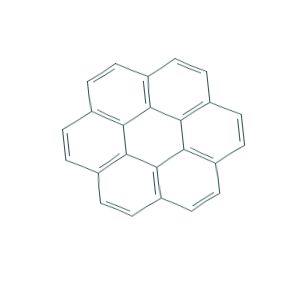
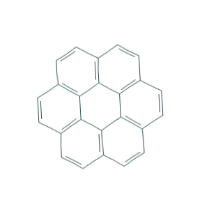
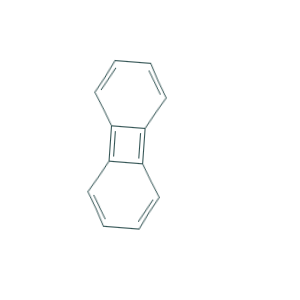
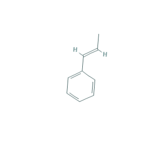
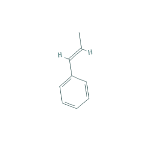

# Using Keras to tackle deep learning for small-data: augmenting organic chemistry structural images to train a convolutional neural network (CNN)
## Carly Wolfbrandt

### Table of Contents
1. [Introduction](#Introduction)
    1. [Small-Data Problem and Image Augmentation using Keras](#small-data) 
2. [Question](#Question)
3. [Model](#model)
    1. [Convolutional Neural Networks](#cnn) 
    2. [Image Augmentation Parameters](#aug)
    3. [Model Hyperparameters](#hp)
    4. [Training](#train)
    5. [Performance](#performance)
4. [Future Work](#future_work)

## Introduction <a name="Introduction"></a>

The skeletal formula of a chemical species is a type of molecular structural formula that serves as a shorthand representation of a molecule's bonding and contains some information about its molecular geometry. It is represented in two dimensions, and is used as a shorthand representation for sketching species or reactions. This shorthand representation is particularly useful in that carbons and hydrogens, the two most common atoms in organic chemistry, don't need to be explicitly drawn.

Each structure conveys unique information about elements and bonding orientation in a chemical species. Since the structures are unique, this means that there is only one correct way to represent every chemical species. This presents an interesting problem when trying to train a neural network to predict the name of a structure - by convention the datasets are going to be sparse. The [hydrocarbon dataset](https://github.com/cwolfbrandt/csk_database/edit/master/README.md) has 1,458 rows, each with a unique name and 300 x 300 pixel structural image.

**Table 1**: Sample rows from hydrocarbon dataset

| Common Name      | IUPAC Name |Molecular Formula | Skeletal Formula | 
| :-----------: | :-----------:| :-----------: | :----------:| 
| coronene      |  coronene | C<sub>24</sub>H<sub>12</sub> |  |
| biphenylene  | biphenylene | C<sub>12</sub>H<sub>8</sub> ||
|1-Phenylpropene | [(E)-prop-1-enyl]benzene | C<sub>9</sub>H<sub>10</sub>|   |

### Small-Data Problem and Image Augmentation using Keras <a name="small-data"></a>

There has been a recent explosion in research of modeling methods geared towards "big-data." Certainly, data science as a discipline has an obsession with big-data, as focus has shifted towards development of specialty methods to effectively analyze large datasets. However, an often overlooked problem in data science is small-data. It is generally (and perhaps incorrectly) believed that deep-learning is only applicable to big-data. 

It is true that deep-learning does usually require large amounts of training data in order to learn high-dimensional features of input samples. However, convolutional neural networks are one of the best models available for image classification, even when they have very little data from which to learn. Even so, Keras documentation defines small-data as 1000 images per class. This presents a particular challenge for the hydrocarbon dataset, where there is 1 image per class. 

In order to make the most of the small dataset, more images must be generated. In Keras this can be done via the `keras.preprocessing.image.ImageDataGenerator` class. This method is used to augment each image, generating a a new image that has been randomly transformed. This ensures that the model should never see the same picture twice, which helps prevent overfitting and helps the model generalize better.

## Question <a name="Question"></a>

Can I build a model that can correctly classify organic chemistry molecules given that my current dataset has only one image per class?

## Model <a name="model"></a>

### Convolutional Neural Networks <a name="cnn"></a>

CNNs take advantage of the fact that the input consists of images and they constrain the architecture in a more sensible way. In particular, unlike a regular Neural Network, the layers of a CNN have neurons arranged in 3 dimensions: width, height, depth.

### Image Augmentation Parameters  <a name="aug"></a>

Keras allows for many image augmentation parameters which can be found [here](https://keras.io/preprocessing/image/). The parameters used, both for initial model building and for the final architecture, are described below: 

```
featurewise_std_normalization = set input mean to 0 over the dataset, feature-wise
featurewise_center = divide inputs by std of the dataset, feature-wise
rotation_range = degree range for random rotations 
width_shift_range = fraction of total width
height_shift_range = fraction of total height
shear_range = shear angle in counter-clockwise direction in degrees
zoom_range = range for random zoom, [lower, upper] = [1-zoom_range, 1+zoom_range]
rescale = multiply the data by the value provided, after applying all other transformations
fill_mode = points nearest the outside the boundaries of the input are filled by the chosen mode
```

When creating the initial small dataset for model building, the following image augmentation parameters were used:

```
rotation_range=40
width_shift_range=0.2
height_shift_range=0.2
rescale=1./255
shear_range=0.2
zoom_range=0.2
horizontal_flip=True
fill_mode='nearest'
```

However, I quickly realized that the model was not learning using images generated with these parameters. First, the features were not normalized or centered. Furthermore, the augmentation ranges were too high for the model to learn anything. For example, a rotation range of +- 40 degrees is fine when the model has many images per class to learn from, but when the model has only one image per class, the augmentations need to be less drastic. Through an iterative process of trial and error, the final parameters were chosen:

```
featurewise_std_normalization=True
featurewise_center=True
rotation_range=10
width_shift_range=0.1
height_shift_range=0.1
shear_range=0.1
zoom_range=0.1
rescale=1./255
fill_mode='nearest'
```

### Model Hyperparameters  <a name="hp"></a>

```
model loss = categorical crossentropy
model optimizer = Adam
optimizer learning rate = 0.0001
optimizer learning decay rate = 1e-6
activation function = ELU
final activation function = softmax
```

`categorical crossentropy` is a loss function that is used for single label categorization. This is when only one category is applicable for each data point. In other words, an example can belong to one class only.

The `Adam` optimization algorithm is different to classical stochastic gradient descent, where the stochastic gradient descent maintains a single learning rate for all weight updates. `Adam` combines the advantages of both `Adagrad` and `RMSProp`, where it maintains a per-parameter learning rate that improves performance on problems with sparse gradients (e.g. natural language and computer vision problems), while also maintaining per-parameter learning rates that are adapted based on the average of recent magnitudes of the gradients for the weight (e.g. how quickly it is changing). Specifically, the `Adam` algorithm calculates an exponential moving average of the gradient and the squared gradient, and the parameters beta1 and beta2 control the decay rates of these moving averages.

The `ELU` activation function, or "exponential linear unit", avoids a vanishing gradient similar to ReLUs, but ELUs have improved learning characteristics compared to the other activation functions. In contrast to ReLUs, ELUs have negative values which allows them to push mean unit activations closer to zero. Zero means speed up learning because they bring the gradient closer to the unit natural gradient. Like batch normalization, ELUs push the mean towards zero. A comparison between ReLU and ELU activation functions can be seen in Figure 1.


**Figure 1**: ELU vs. ReLU activation functions

The `softmax` function highlights the largest values and suppresses values which are significantly below the maximum value, though this is not true for small values. It normalizes the outputs so that they sum to 1 so that they can be directly treated as probabilities over the output.

### Model Architecture <a name="architecture"></a>

Sample architecture of a simple CNN: 
```
INPUT [50x50x3] will hold the raw pixel values of the image, in this case an image of width 50, height 50, and with three color channels R,G,B.
CONV layer will compute the output of neurons that are connected to local regions in the input, each computing a dot product between their weights and a small region they are connected to in the input volume.
ACTIVATION layer will apply an elementwise activation function, leaving the volume unchanged.
POOL layer will perform a downsampling operation along the spatial dimensions (width, height), resulting in a smaller volume.
```
The code snippet below is the architecture for the model - a simple stack of 3 convolution layers with an ELU activation followed by max-pooling layers. This is very similar to the architectures that Yann LeCun advocated in the 1990s for image classification (with the exception of ReLU).

### Training <a name="train"></a>

In order to create a model with appropriately tuned hyperparameters, I started training on a small dataset; the initial training set had 3 classes, specifically chosen to have vastly different features. For each of the 3 classes, I used image augmentation to create 100 training images per class. Table 2 shows the initial 3 classes chosen for training and samples of the augmented images.


**Table 2**: Sample augmented images using Keras

| Structural Image      | Augmented Image Example 1 | Augmented Image Example 2 | Augmented Image Example 3 |
| :-----------: | :-----------:| :-----------: | :----------:| 
| |  |  |    |
| |  |  |    |
| |  |  |    |


### Performance <a name="performance"></a>

## Future Work <a name="future_work"></a>
